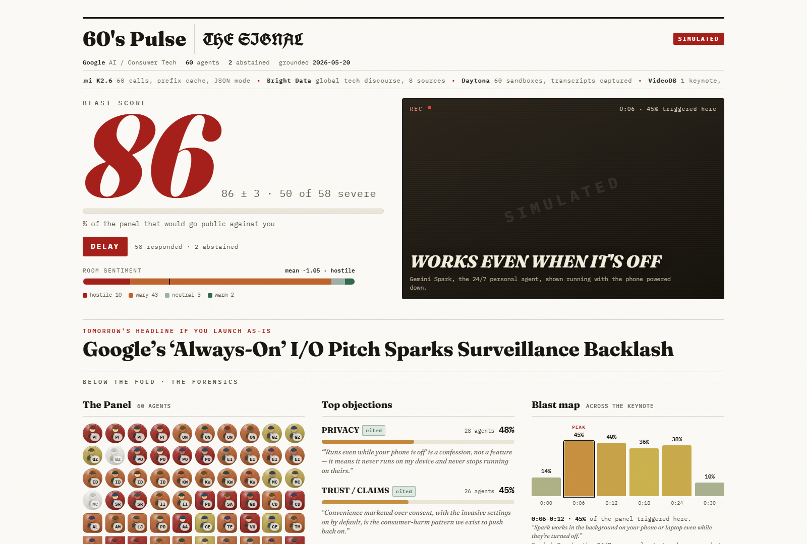

# 60's Pulse

**Pressure-test an ad campaign against 60 AI critics — before the public gets to it.**


Brands launch creative blind, and one wrong line becomes tomorrow's apology tour. **60's Pulse**
simulates a 60-persona reaction panel — each agent grounded in live public discourse — to flag
exactly which lines, scenes, or concepts will backfire, then tells you the cheapest fix:
**rewrite the copy, reshoot the scene, or rethink the concept.**

Built at the **Agent Forge AI Hackathon** (SMU, June 2026).



---

## What it does

Paste a campaign — copy, a keynote script, an announcement, or a video — and 60's Pulse returns a
**campaign premortem**, not a sentiment score:

- **Blast Score** — the share of the panel likely to object strongly enough to go public, boycott,
  report, or generate negative coverage.
- **60-agent reaction panel** — personas, concern lenses, and stakeholders react to the same
  creative; each gives a quote, severity, trigger moment, fix tier, and press-conference question.
- **Blast map** — for video, it pinpoints *which second* detonates the panel ("0:06 is the shot").
- **Objection clusters** — reactions grouped by theme (privacy, consent, representation, trust…).
- **Three-tier fix triage** — every objection tagged by the cheapest intervention that fixes it:
  **copy**, **production**, or **decision**.
- **Tomorrow's headline** — a fictional front page showing the likely narrative if it ships unchanged.

The core question shifts from *"is this positive or negative?"* to
**"what exactly will people attack, who amplifies it, which second caused it, and what's the cheapest fix?"**

## See it in action

The bundled demo stress-tests a **real, publicly announced** keynote — Google's I/O 2026
"always-on AI" launch — read in its most adversarial light:

> An AI agent that runs *"even while your phone is off,"* connects your Gmail and Photos, and reads
> your inbox overnight.

60's Pulse returns **Blast Score 86 → verdict: DELAY**, with the panel splitting on privacy (48%),
trust/claims (45%), and surveillance. It then shows the fix path:

```text
86  As presented
 │   rewrite the "always-on" lines              (copy)
76  ▼
 │   make every connection opt-in, off by default (production)
38  ▼
38  The always-on autonomous-agent premise itself — not a settings toggle. Your call.  (decision)
```

That final **38 is the client decision**: 60's Pulse doesn't pretend copy can save a premise.

> All reactions are synthetic and the masthead is fictional. The demo is an illustrative analysis of
> publicly announced features — not a prediction, endorsement, or accusation about any company.

## How it works

```
campaign (text / image / video)
        │
        ▼
  VideoDB      ── frame-by-frame parse → scenes + transcript + creative manifest
        │
        ▼
  Kimi         ── orchestrates 60 agents in parallel, each producing a structured reaction
   + Daytona   ── each agent sandboxed in secure isolation
   + Bright Data ── each persona grounded in real-time Reddit & Google News discourse
        │
        ▼
  scoring      ── Blast Score, objection clusters, blast map, three-tier fix triage
        │
        ▼
  dashboard    ── a single war-room broadsheet (FastAPI + static front end)
```

To stay demo-safe on stage, a full run is **baked offline** into one JSON artifact
(`golden/golden_run.json`); the dashboard replays it, so the presentation never depends on Wi-Fi,
sponsor latency, or 60 live calls.

## Tech stack

| Tool | Role |
|------|------|
| **Kimi (Moonshot AI)** | Orchestrates all 60 agents in parallel; structured reaction panel. |
| **Bright Data** | Grounds each persona in real-time public discourse (Reddit, Google News). |
| **Daytona** | Sandboxes each agent in secure isolation, with execution receipts. |
| **VideoDB** | Frame-by-frame video parsing → scenes, transcript, creative manifest. |

Backend is **FastAPI** + a static dashboard. An OpenAI-compatible provider is supported as a cheap
dev fallback for the panel.

## Why 60 agents

The panel is designed for **risk coverage**, not census polling:

- **35 public personas** — consumer reactions and social-sharing behavior.
- **15 concern lenses** — sensitive risk areas inspected in third person (consent, accessibility,
  child data, religious sensitivity, representation, low-income impact).
- **10 stakeholder agents** — the groups that turn a bad comment into consequences: journalists,
  regulators, ad-standards bodies, competitors, employees, and advocacy groups.

Identity-sensitive perspectives are handled as third-person concern lenses, not first-person
roleplay — which is safer and more defensible.

## Quickstart

No API keys required — fixture mode runs the baked demo entirely offline.

```bash
python -m pip install -r requirements.txt
uvicorn app.main:app --reload
# open http://127.0.0.1:8000
```

Static demo smoke checks:

```bash
curl http://127.0.0.1:8000/healthz
curl -I http://127.0.0.1:8000/
curl -I http://127.0.0.1:8000/app.js
curl -I http://127.0.0.1:8000/styles.css
```

Run the no-network smoke test:

```bash
python bake.py --mode fixture --mini 2
```

## Live mode

Live mode regenerates the 60 reactions through the sponsor stack. Copy `.env.example` to `.env` and
fill the keys for the path you want — fixture mode needs none of them.

```bash
python bake.py --mode live --mini 6                               # cheap live smoke (6 agents)
python bake.py --mode live                                        # full 60-agent live bake
python bake.py --mode live --allow-baked-grounding --mini 6        # explicit fallback when iterating without Bright Data zones
python bake.py --mode live --mini 3 --sandbox daytona --sandbox-mini 3   # + Daytona receipts and sandbox Bright Data scrape
python bake.py --mode live --video-source "https://…/ad.mp4" --mini 6    # + VideoDB ingest
```

| Variable | Used by |
|----------|---------|
| `KIMI_API_KEY`, `KIMI_BASE_URL`, `KIMI_MODEL` | 60-agent panel |
| `BRIGHTDATA_API_KEY`, `BRIGHTDATA_SERP_ZONE`, `BRIGHTDATA_UNLOCKER_ZONE` | persona grounding |
| `DAYTONA_API_KEY`, `DAYTONA_API_URL` | agent sandboxing |
| `VIDEODB_API_KEY` | video ingest |
| `OPENAI_API_KEY`, `OPENAI_BASE_URL`, `OPENAI_MODEL` | optional dev provider |

## Project status

This is a hackathon project. What's live today:

- ✅ Static war-room dashboard served by FastAPI
- ✅ Baked golden run + live/fixture bake script
- ✅ Kimi (or OpenAI-compatible) 60-agent panel generation
- ✅ Live typed-campaign path via `POST /api/analyze`
- ✅ Bright Data Google News / Reddit parsing with explicit grounding receipts
- ✅ Optional Daytona sandbox receipts, including sandbox-side Bright Data scraping
- ✅ Optional VideoDB creative ingest in bake and `/api/analyze`

`POST /api/analyze` defaults to the Kimi/OpenAI-compatible typed-campaign panel. Add
`"brightdata": true`, `"daytona": true`, or `"videodb": true` to opt into the sponsor stack for a
single request. VideoDB requests must include `"video_source"`. Live Bright Data fallback is only used
when `"allow_baked_grounding": true` is set.

## Team

Built at the Agent Forge AI Hackathon 2026 by:

- **Denise Lie** ([@deniseLie](https://github.com/deniseLie))
- **Kim Yungju** ([@kimyungju](https://github.com/kimyungju))
- **Huan Yuhan** ([btzzcold](https://github.com/btzzcold))
- **Hor Xiang Zhi** ([@clouery](https://github.com/clouery))

## License

[MIT](LICENSE) © 2026 60's Pulse contributors.
